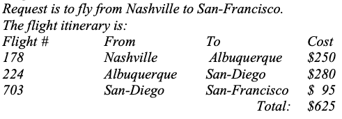
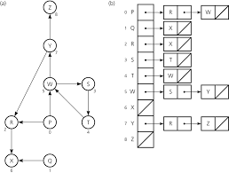
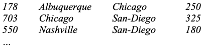
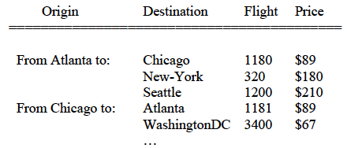

# Instructions  
( __This project implements the preparation code for the next project. So, it is important that this project is
implemented accurately.__)


The BlueSky airline company wants you to help them develop a program that generates flight itinerary for customer requests to fly from some origin city to some destination city. For example, a complete itinerary is given below:


But first, it is important to have an efficient way of storing and maintaining their database of all available flights of the company. We want to organize these flights in a manner where all the flights coming out of each city is easily searchable. This is called the flight map. The data structure we will use to build the flight map is called an Adjacency List. The adjacency list consists of an array of head pointers, each pointing to a linked list of nodes, where each node contains the flight information. The ith array element corresponds to the ith city (the origin city) served by the company, and the jth node of that linked list correspond to the jth city that the origin city flies to.


First, your program should read in a list of city names for which the company currently serves. The list of names can be read from a data file named “cities.dat”. Then, your program reads in a list of flights currently served by the company. The flight information can be read from the data file “flights.dat”.

___cities.dat___ : the names of cities that BlueSky airline serves, one name per line, for example:
```
16 <- number of cities served by the company
Albuquerque 
Chicago 
San-Diego 
Nashville
...
```
___flights.dat___ : each flight record contains the flight number, a pair of city names (each pair represents the origin and destination city of the flight) plus a price indicating the airfare between these two cities, for example:

After reading and properly storing these information, you program should print out the flight map in a well formatted table:


Program requirements:
1. Define the flight record as a struct type. Put the definition in the header file type.h
* Overload the operators ==, <, =, and << operators for this struct type.
* Put the implementation of these operators, and any other methods you want, in type.cpp
2. Implement a FlightMap class, which has the following data and the following methods:
* Data
  1. Number of cities served by the company
  2. list of cities served by the company
     * The STL vector is to be used for the list of cities served by the company.
  3. flight map implemented in the form of an adjacency list, e.g., array of lists.
     * The STL list needs to be used to implement each list
     * The array needs to be created dynamically. The actual size of the array is
based on the number of cities served by the company. Therefore, the array
needs to be defined as a pointer to the list of flight records.
     * It should be noted that this array is parallel to the array of cities, e.g., data
item 2 above
* Methods:
  * constructor(s) and destructor
    1. default constructor
    2. copy constructor
       * make sure to use new operator to allocate space for the flight map before copying the lists
       * destructor – releases memory space dynamically allocated
  * operations
    1. read cities (cities.dat)
        * This method takes one parameter: the input file stream opened for the data file: “cities.dat”
        * The input file stream should be opened in the main function and passed in to this method as parameter. Do not open this specific file in the method itself
    2. read flight information and build the adjacency list (flights.dat)
        * This is the code that builds the adjacency list with information from the flights.dat file.
        * Dynamically allocate space for the flight map pointer before start reading the flight records and build the adjacency list
        * Overloaded << operator that displays the flight information as shown above.


Additional methods will be added to the FlightMap class in the next project to solve the overall problem of
flight itinerary generation.
Make sure to follow the exact data structure and STL container requirements.